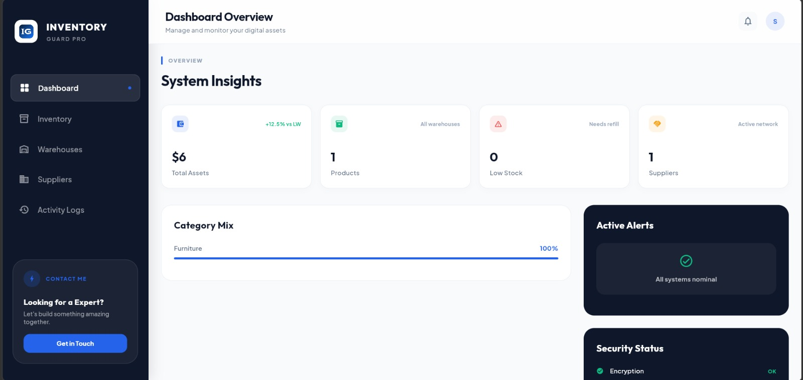
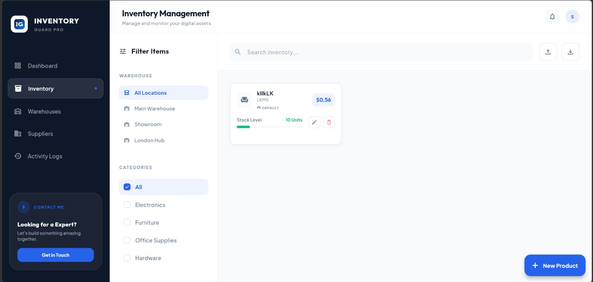
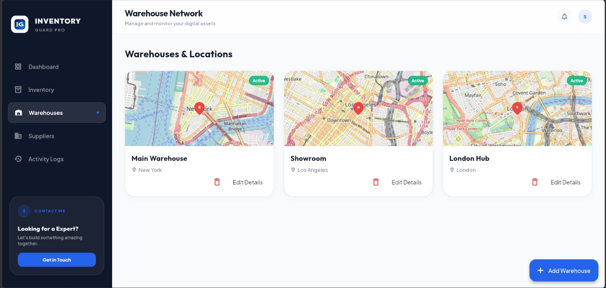
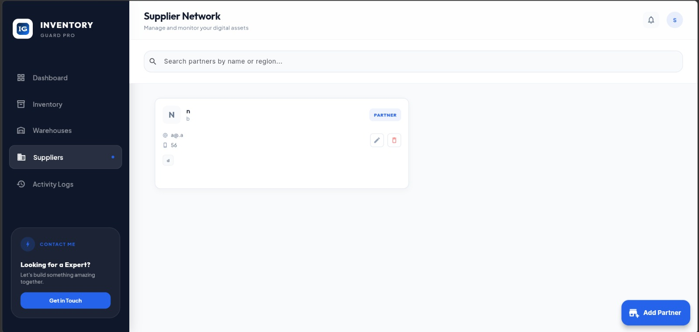
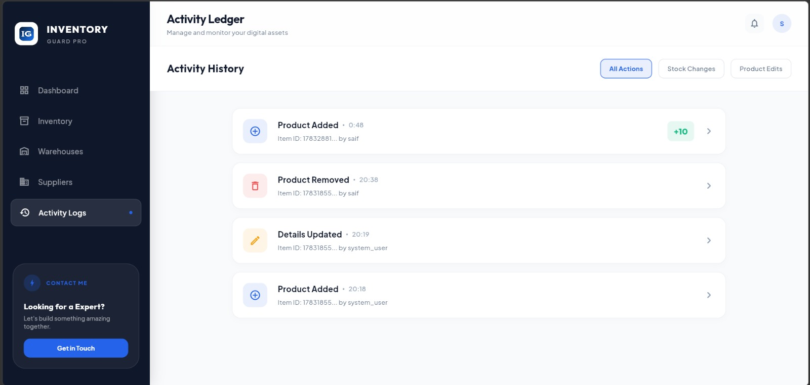
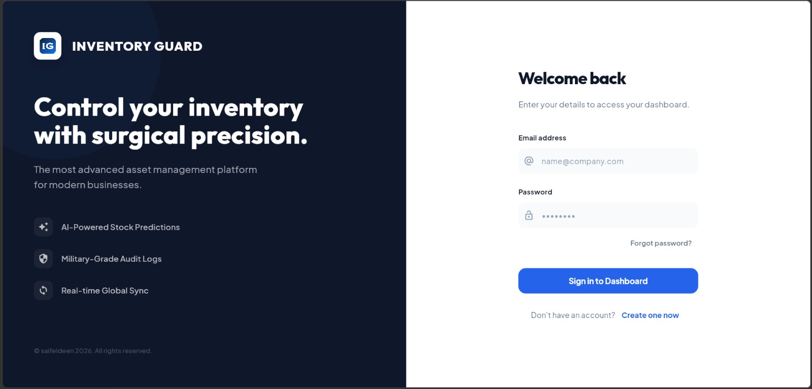
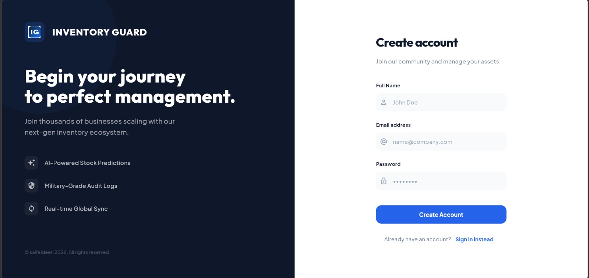
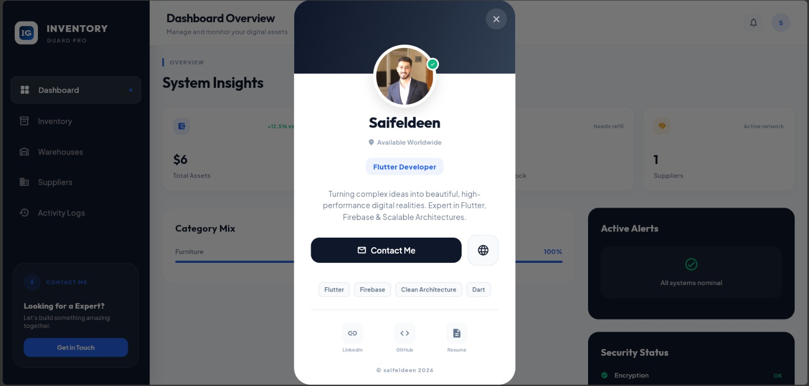

# Inventory Guard

> **Digital inventory management & asset tracking platform** — built with Flutter, Firebase, and Clean Architecture.  
> Track products, warehouses, suppliers, and audit logs from a single dashboard with offline-first support and real-time sync.  
> **Live demo:** [inventory-guard--oa-test.web.app](https://inventory-guard--oa-test.web.app/)



---

## Features

### 📊 Dashboard
Real-time analytics with stat cards (total assets, product count, low stock alerts, suppliers), category distribution with progress bars, active alerts panel, and security status indicators.


### 📦 Products
Full CRUD with CSV import/export, search, category and warehouse filtering, stock level indicators, low-stock threshold alerts, and bulk operations. The product detail dialog links to warehouse selection.



### 🏭 Warehouses
Map-integrated warehouse management using OpenStreetMap (`flutter_map`). Each warehouse displays an interactive mini-map with location markers. Add warehouses by tapping directly on the map to set coordinates.



### 🤝 Suppliers
Manage your supply network with company profiles, contact information, and category tagging. Quick partner registration dialog with search and filtering.



### 📋 Audit Logs
Immutable activity ledger tracking every product mutation — creates, updates, deletes, stock-ins, and stock-outs. Filterable by action type with color-coded timeline entries.



### 🔐 Authentication
Email/password authentication via Firebase Auth with login, registration, and password reset flows. Responsive split-screen design for desktop.

  |  

---

## Architecture

```
lib/
├── core/                       # Shared across features
│   ├── config/                 # Backend selection (Firebase / REST API)
│   ├── database/sqlite/        # Local SQLite schema & helper
│   ├── domain/                 # Value objects
│   ├── error/                  # Failure & exception definitions
│   ├── network/                # Connectivity monitoring
│   ├── notifications/          # In-app notification system
│   ├── theme/                  # Colors, typography, theme data
│   ├── usecases/               # Abstract use case base class
│   ├── utils/                  # CSV import/export utilities
│   └── widgets/                # Reusable UI components
│
└── features/
    ├── auth/                   # Authentication (login, register, reset)
    ├── dashboard/              # Analytics & KPIs
    ├── products/               # Product CRUD, search, filtering
    ├── warehouses/             # Warehouse CRUD with map integration
    ├── suppliers/              # Supplier CRUD with contact management
    └── audit/                  # Immutable audit logging
```

Each feature follows **Clean Architecture** with three layers:

```
feature/
├── data/                       # Data layer
│   ├── datasources/            # Remote (Firestore/API) + Local (SQLite)
│   ├── models/                 # JSON serializable models
│   └── repositories/           # Repository implementations
├── domain/                     # Domain layer
│   ├── entities/               # Business entities with domain logic
│   ├── enums/                  # Enum types
│   ├── repositories/           # Abstract repository interfaces
│   └── usecases/               # Business logic use cases
└── presentation/               # Presentation layer
    ├── cubit/                  # BLoC/Cubit state management
    ├── pages/                  # Full-screen widgets
    └── widgets/                # Reusable UI components
```

---

## Tech Stack

| Layer              | Technology                                                      |
|--------------------|-----------------------------------------------------------------|
| **Framework**      | Flutter (SDK ^3.12.2)                                           |
| **State Mgmt**     | flutter_bloc 9.x + Cubit + Equatable                            |
| **DI**             | get_it (service locator)                                        |
| **Backend**        | Firebase Auth + Cloud Firestore (with REST API fallback)        |
| **Local DB**       | SQLite (sqflite) — offline-first on mobile                      |
| **Maps**           | flutter_map + OpenStreetMap + latlong2                          |
| **Auth**           | FirebaseAuth (email/password)                                   |
| **Notifications**  | Custom in-app notification system with deduplication            |
| **CSV**            | csv + file_picker + universal_html (browser download)           |
| **Typography**     | Google Fonts (Outfit + Plus Jakarta Sans)                       |
| **Architecture**   | Clean Architecture + Decorator Pattern                          |

---

## Screenshots

| Screen | Preview |
|--------|---------|
| Dashboard |  |
| Products |  |
| Warehouses |  |
| Suppliers |  |
| Activity Logs |  |
| Login |  |
| Register |  |
| Profile Card |  |

---

## Getting Started

### Prerequisites

- Flutter SDK ^3.12.2
- Firebase project with Auth (email/password) and Firestore enabled
- Dart SDK ^3.12.2

### Setup

```bash
# Clone the repository
git clone https://github.com/SaifEldien/inventory_guard.git
cd inventory_guard

# Install dependencies
flutter pub get

# Configure Firebase
# Place your firebase_options.dart (from FlutterFire CLI) in lib/
# Or use the existing configuration for inventory-guard--oa-test

# Run the app
flutter run
```

### Backend Selection

The app supports switching between Firebase and a custom REST API at compile time:

```dart
// lib/core/config/app_config.dart
AppConfig.activeBackend = BackendType.firebase; // or BackendType.api
```

---

## Architecture Highlights

### Offline-First (Mobile)
On native platforms, all data is cached locally in SQLite. Reads come from local storage first, then sync with remote. On web, direct Firestore access is used since local storage isn't available.

### Audit Decorator Pattern
`ProductAuditDecorator` wraps `ProductRepository` to automatically log every mutation as an immutable audit trail entry — without modifying the core repository logic.

### Responsive Layout
The shell adapts between a sidebar navigation (wide screens > 900px) and a bottom navigation bar (narrow screens) with a single `IndexedStack` preserving tab state.

---

## Project Structure

```
inventory_guard/
├── assets/
│   ├── images/
│   │   └── saif.jpg
│   ├── logos/
│   │   └── logo.png
│   └── screenshots/
│       ├── dashboard.jpeg
│       ├── login.jpeg
│       ├── logs.jpeg
│       ├── products.jpeg
│       ├── profileCard.jpeg
│       ├── register.jpeg
│       ├── supplier.jpeg
│       └── warehouse.jpeg
├── lib/
│   ├── main.dart
│   ├── main_navigation_screen.dart
│   ├── injection_container.dart
│   ├── firebase_options.dart
│   ├── core/
│   └── features/
│       ├── auth/
│       ├── dashboard/
│       ├── products/
│       ├── warehouses/
│       ├── suppliers/
│       └── audit/
├── test/
└── pubspec.yaml
```

---

## Author

**Saifeldeen (Saif Ahmed)**  
[GitHub](https://github.com/SaifEldien) · sief.ahmed98@yahoo.com

---

## License

This project is a private application. All rights reserved.
